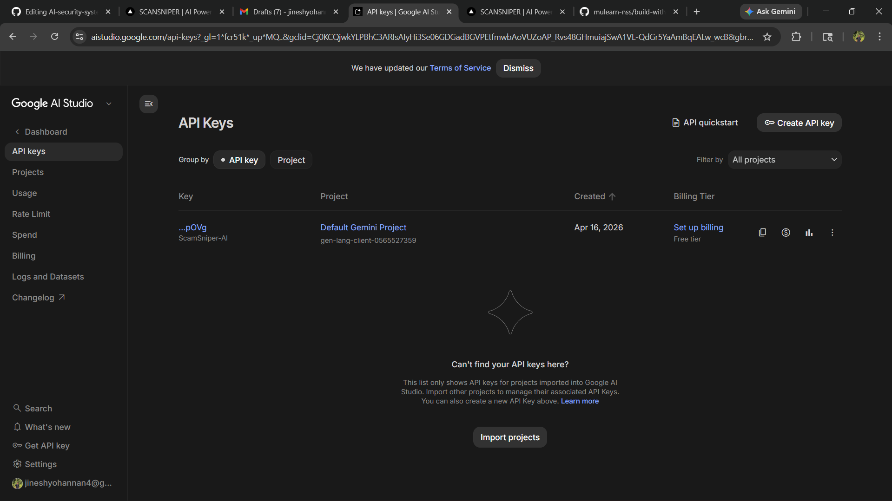
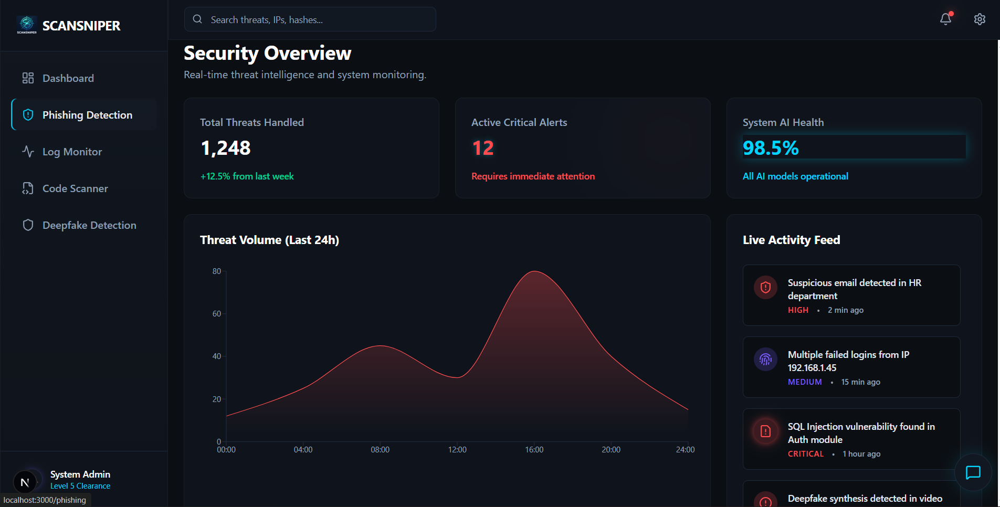

# 🚀SCANSNIPER AI

---

## 📌 Problem Statement
Explain clearly what problem your project is solving.

Cybersecurity threats like phishing, fraud, and misinformation are increasing rapidly, and users lack accessible tools to detect and understand these threats in real time.

---

## 💡 Project Description
Describe your solution, how it works, and what makes it useful.

Sentinel AI is an AI-powered cybersecurity platform that detects threats such as phishing attacks, suspicious logs, code vulnerabilities, and deepfakes. It uses advanced AI models to analyze inputs, generate risk scores, and provide clear explanations through an interactive dashboard and AI copilot.

---

## 🤖 Google AI Usage

### 🛠️ Tools / Models Used
- Gemini 1.5 Flash (via Google AI Studio)
- Vertex AI (optional for anomaly detection)
- Firebase (Auth + Database)
- Google Cloud (hosting)

---

### ⚙️ How Google AI Was Used
Gemini API is used to:
- Analyze phishing emails and URLs
- Detect vulnerabilities in code
- Generate explanations for threats
- Power the AI chatbot (security copilot)

---

## 📸 Proof of Google AI Usage



---
## 📸ScreenShots




## 🌟 Key Features
- Phishing & scam detection  
- Security log anomaly detection  
- Code vulnerability scanner  
- Deepfake & misinformation detection  
- AI-powered security copilot  

---

## 🧠 Tech Stack
- Frontend: React + Tailwind  
- Backend: FastAPI / Node.js  
- AI: Gemini API  
- Database: Firebase / Firestore  

---

## ⚙️ Installation Steps

### 1. Clone the repository
```bash
git clone https://github.com/YOUR-USERNAME/YOUR-REPO.git
cd YOUR-REPO
npm install
npm run dev
uvicorn main:app --reload
